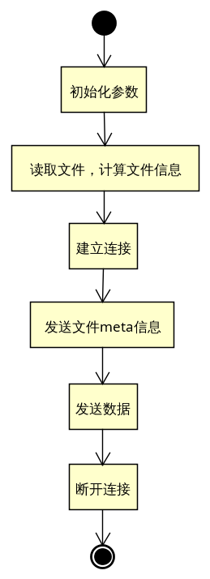
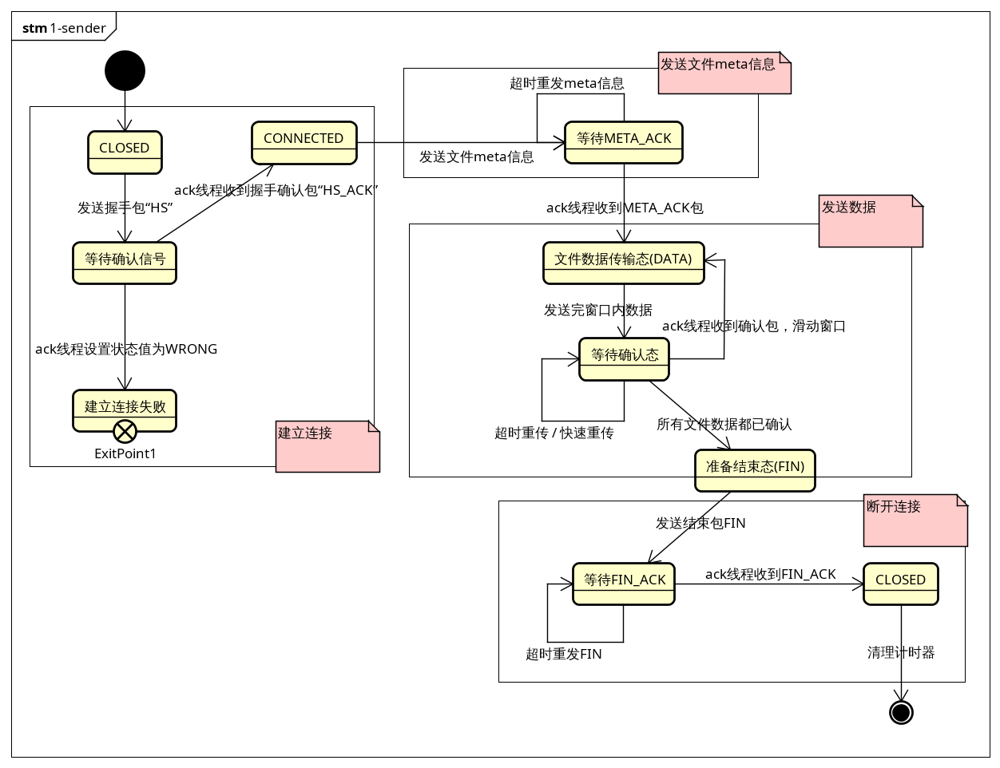
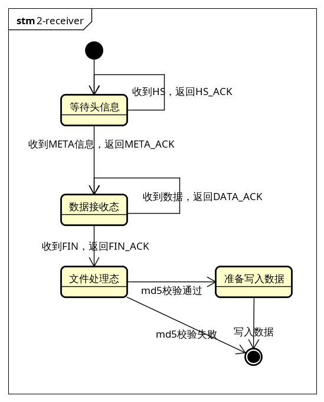

### sender整体流程




### sender状态转换图




### receiver状态转换图




协议：

整体思路为使用udp模拟tcp通信，但与tcp不完全相同。

下层udp数据包格式和大小固定，使用struct格式化：

```
struct.pack('ii8s1000s', seq, ack, command, data)
```

前两位 `ii` 表示两个整数，分别表示此次：己方数据包的序号seq、应答对方数据包序号ack

`8s` 即使用长度为8的字符串表示该数据包的数据类型，定义了如下数据类型：

- HS：握手包，建立连接时由sender发出
- HS_ACK：握手应答包，由receiver在接收到HS包时发出
- META：文件meta信息包，由sender发出
- META_ACK：文件信息应答包，由receiver应答META包时发出
- DATA：文件数据包，由sender发出
- DATA_ACK：文件数据应答包，由receiver应答DATA包时发出
- FIN：传输结束包，由sender发出
- FIN_ACK：传输结束应答包，由receiver发出

`1000s` 即每个包中使用1000个字符发送具体数据内容。sender发送的META包和DATA包需要提供该部分数据。其他类型的数据包不需要提供该部分的数据，程序自动使用1000个 `'\x00'` （即ASCII表中的0x00）填充。


双方通信时，流程如下：

1. sender发送HS包
2. receiver收到HS包后发送HS_ACK包进行应答
3. sender收到HS_ACK后发送META包
4. receiver收到META包后，保存文件meta信息，并发送META_ACK包进行应答
5. sender收到META_ACK包后开始发送DATA包，即发送文件内容
6. receiver收到DATA包后需要发送DATA_ACK包进行应答
7. 重发进行步骤5、6，直至所有文件内容被发送并确认
8. sender发送FIN包表示传输结束
9. receiver发送FIN_ACK包，不再接收数据，验证并保存文件
10. sender收到FIN_ACK后退出


因为网络环境可能变得很不稳定，数据包在传输过程中可能丢失或被重复发送。

对于sender发出的每个数据包，都有一个seq表示包的编号。seq为-2表示握手包，为-1表示meta信息包，0和正数表示文件数据包。Receiver按顺序接收这些包，如果顺序不对，存在两种可能：1. Receiver收到了重复的包，直接丢弃；2. Receiver收到的包序号过大，说明网络传输过程中正确序号的包被丢失，这时Receiver使用DATA_ACK包的ack字段告知sender最后一次正确接收的数据包的序号。


Receiver较简单，单线程即可。设计重点在sender上。

sender可以使用单线程也可以使用多线程，为了保证数据传输的可靠性，sender在发送一批数据后要等待Receiver对发送的数据的确认包。如果sender收到正确的确认信息，就继续传输下一批数据；如果在设定时间（3s）内没有收到确认信息，则重发该数据；如果收到的确认信息是很早之前已经确认过的，继续等待其他确认包；如果连续多次收到相同的数据确认包，说明发生了丢包，直接重发尚未收到确认的包（快速重传）。

sender如果使用单线程，需要在每次发送数据后等待对方的应答，若此时应答包丢失，sender需要被迫等待很长时间（直至超时）才能继续下一步动作（重发），效率太低。

sender如果使用多线程，可以使用一个线程（线程1）负责发送数据，另一个线程（线程2）负责处理应答包。线程2收到应答包后设置相应的状态值，线程1不停地监测这些状态值，并根据不同的状态采取不同的行为（发送不同类型的数据包）。

